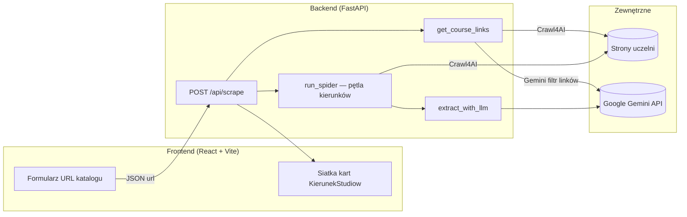

# Scrapzz — opis projektu

> **Dokument:** wprowadzenie do aplikacji — co robi, jak działa, z czego jest zbudowana.  
> **Instrukcja uruchomienia:** patrz [`README.md`](README.md).

---

## Czym jest Scrapzz?

**Scrapzz** to agregator danych o kierunkach studiów na polskich uczelniach. Użytkownik podaje URL **strony katalogu** (lista kierunków), a aplikacja:

1. Odnajduje linki do poszczególnych kierunków.
2. Odwiedza każdą stronę kierunku w przeglądarce headless.
3. Wyciąga ustrukturyzowane dane (nazwa, stopień, tryb, semestry, czesne, opis itd.).
4. Prezentuje wyniki w interfejsie webowym.

Projekt łączy **web scraping** (Crawl4AI + Playwright) z **ekstrakcją LLM** (Google Gemini). LLM nie zastępuje scrapera — dostaje oczyszczony tekst strony i zwraca JSON zgodny ze schematem Pydantic.

---

## Architektura



**Dwa procesy dev:**
- Backend: `python scraper.py` → port **8000**
- Frontend: `npm run dev` w `frontend/` → port **5173**

---

## Workflow end-to-end

### Krok 1 — Użytkownik podaje URL katalogu

Przykłady działających katalogów:
- Ideis: `…/studia-i-stopnia`
- UŁ: `…/rekrutacja/oferta-studiow/strona`
- PŁ: `rekrutacja.p.lodz.pl/kierunek`
- ATA: `akademiata.pl/oferta/studia-1-stopnia/`

Frontend wysyła `POST /api/scrape` z `{ "url": "..." }`.

### Krok 2 — Pobranie i filtrowanie linków (`get_course_links`)

1. **Crawl4AI** otwiera katalog w Chromium (headless).
2. **JavaScript prep** (`CATALOG_JS_PREP`): cookies, zamknięcie menu, czekanie na treść listy, scroll (lazy-load).
3. Strona → **markdown**.
4. **Gemini** (prompt filtra) zwraca tablicę linków do kierunków.
5. **Hybrydowy post-filter** (regex, bez LLM):
   - odrzuca śmieci (kontakt, MBA, FAQ…),
   - odrzuca strony katalogu / paginacji,
   - wpuszcza resztę (bez sztywnej whitelisty ścieżek).
6. **Fallback:** jeśli Gemini zwróci 0 linków, linki są parsowane z HTML crawla.

### Krok 3 — Scrapowanie kierunków (`run_spider`)

Dla każdego linku (max **`MAX_COURSES_PER_RUN = 5`**):

1. Crawl strony kierunku z **`COURSE_JS_PREP`** (cookies, scroll, czekanie na AJAX cennika).
2. **Przygotowanie markdownu:** filtr PR wydziału z zaworem bezpieczeństwa.
3. **Uzupełnienie opłat:** jeśli markdown nie ma kwot, doklejana sekcja cennika z HTML.
4. **Gemini** → jeden obiekt `KierunekStudiow` (JSON, `temperature=0.0`).
5. **Post-processing deterministyczny:**
   - `normalize_czesne()` — bez rat, deduplikacja,
   - `normalize_tryb()` — korekta trybu z sekcji kontaktu (np. UŁ),
   - fallback `extract_czesne_from_html()` gdy LLM zwróci `null`.

Błąd jednego kierunku **nie przerywa** całego runu — zwracany jest partial success.

### Krok 4 — Prezentacja (React)

- Statystyki: znalezione / przetworzone / sukces.
- Karty z polami skróconymi; rozwinięcie → opis, tabela czesne, specjalizacje, link źródłowy.

---

## Stack technologiczny

| Warstwa | Technologia | Rola |
|---------|-------------|------|
| **Backend** | Python 3.12+ | Logika spidera i API |
| **API** | FastAPI + Uvicorn | REST, Swagger `/docs` |
| **Scraping** | Crawl4AI 0.9 + Playwright | Headless Chromium, JS, markdown |
| **LLM** | Google Gemini (`gemini-3.1-flash-lite`) | Filtr linków + ekstrakcja pól |
| **Walidacja** | Pydantic v2 | Schemat `KierunekStudiow` |
| **Konfiguracja** | python-dotenv | `.env` — klucz API, model |
| **Frontend** | React 19 + Vite 8 | UI |
| **Styling** | CSS (bez frameworka) | `App.css`, `index.css` |

---

## Model danych — `KierunekStudiow`

Jeden URL kierunku = **jeden obiekt JSON**.

| Pole | Typ | Opis |
|------|-----|------|
| `kierunek` | string | Nazwa **dosłownie ze strony** (bez tłumaczenia) |
| `stopien` | enum | `1_stopnia` / `2_stopnia` / `jednolite_magisterskie` |
| `tytul` | enum | `licencjat` / `inżynier` / `magister` |
| `tryb` | lista | `stacjonarne`, `niestacjonarne` |
| `semestry` | int | Liczba semestrów (wymagane) |
| `wydzial` | string \| null | Wydział prowadzący |
| `jezyk` | string | Domyślnie `"polski"` |
| `specjalizacje` | lista | Pusta `[]` jeśli brak |
| `rekrutacja` | lista | Przedmioty maturalne / zasady |
| `czesne` | lista \| null | `{ wariant, kwota }[]` — null gdy brak danych |
| `opis` | string | 2–3 zdania o **programie**, nie o PR uczelni |

---

## Wzorce jakości danych

Powtarzalny schemat w całym projekcie:

```
Prompt LLM  →  normalizacja Python  →  zawór bezpieczeństwa
```

| Obszar | LLM (prompt) | Normalizacja (kod) | Zawór |
|--------|--------------|-------------------|-------|
| **Linki** | Rygorystyczny filtr katalogu | Hybrid regex (junk + katalog) | Fallback HTML |
| **opis** | Bez rankingów / PR wydziału | `prepare_markdown_for_extraction()` | Przy utracie treści → oryginał |
| **czesne** | Bez zmyślania; raty OK dosłownie | `normalize_czesne()` | Przy pustej liście → oryginał LLM |
| **tryb** | Tylko strefa oferty pod H1 | `normalize_tryb()` | Tylko gdy LLM dał 2 tryby |
| **czesne (ideis)** | — | `augment_markdown_with_fee_content()` | `extract_czesne_from_html()` |

---

## API

| Metoda | Endpoint | Opis |
|--------|----------|------|
| `GET` | `/health` | `{ "status": "ok" }` |
| `POST` | `/api/scrape` | Body: `{ "url": "https://..." }` |

**Odpowiedź `ScrapeResponse`:**

```json
{
  "status": "success",
  "links_found": 19,
  "links_processed": 5,
  "results": [
    { "url": "...", "data": { } },
    { "url": "...", "error": "..." }
  ]
}
```

Swagger: [http://127.0.0.1:8000/docs](http://127.0.0.1:8000/docs)

---

## Konfiguracja i limity

| Stała / env | Wartość | Znaczenie |
|-------------|---------|-----------|
| `GEMINI_API_KEY` | `.env` | **Wymagane** |
| `GEMINI_MODEL` | domyślnie `gemini-3.1-flash-lite` | Model ekstrakcji |
| `MAX_COURSES_PER_RUN` | `5` | Max kierunków na jeden request |
| `GEMINI_MIN_INTERVAL` | `4.0` s | Rate limiting między wywołaniami |
| `VITE_API_BASE` | `frontend/.env` | URL backendu dla UI |

**Zużycie Gemini na jeden run:** ~1 wywołanie (katalog) + do 5 (kierunki) = **max 6 zapytań**.

---

## Struktura repozytorium

```
Scrapzz/
├── scraper.py              # Cały backend: spider + API + normalizacja
├── requirements.txt
├── .env.example
├── README.md               # Jak uruchomić (quick start)
├── PROJECT.md              # Ten dokument — opis i architektura
├── .python-version
└── frontend/
    ├── src/App.jsx         # UI
    ├── src/App.css
    └── .env.example
```

Logika spidera jest **monolityczna** w `scraper.py` (~1000 linii) — świadoma decyzja na etapie MVP.

---

## Znane ograniczenia

- **Max 5 kierunków** na request (limit API / czasu).
- **CORS `*`** — tylko development.
- **Strony mocno dynamiczne** (AJAX cenników, np. Ideis) — wymagają JS prep; czasem czesne uzupełniane z HTML.
- **Jakość zależy od layoutu uczelni** — każda nowa domena może wymagać dopracowania heurystyk.
- **LLM nie jest deterministyczny w 100%** mimo `temperature=0.0` — post-processing łagodzi skutki.
- **Brak persystencji** — wyniki nie są zapisywane do bazy; tylko odpowiedź HTTP.

---

## Testowane uczelnie (referencja)

| Uczelnia | Typ strony | Uwagi |
|----------|------------|-------|
| Ideis | Katalog + AJAX cennik | Hybrid filter, augment czesne |
| UŁ (uni.lodz.pl) | TYPO3, cookie, tryb z kontaktu | JS prep katalogu, `normalize_tryb` |
| PŁ | `rekrutacja.p.lodz.pl` | Junk filter po ścieżce, nie hoście |
| ATA | WordPress | Catalog JS prep |
| Koźmiński | Czesne semestralne | `normalize_czesne` |

---

## Kierunek rozwoju

- Zwiększenie `MAX_COURSES_PER_RUN` / kolejkowanie jobów
- Persystencja wyników (SQLite / PostgreSQL)
- Docker Compose
- Testy regresji per domena uczelni
- Produkcja: CORS, auth, HTTPS

---

## Słowniczek

| Termin | Znaczenie |
|--------|-----------|
| **Katalog** | Strona z listą linków do kierunków |
| **Kierunek** | Strona szczegółowa jednej oferty studiów |
| **Markdown** | Tekst strony po konwersji Crawl4AI — input dla Gemini |
| **Post-filter** | Deterministyczna walidacja po LLM |
| **Partial success** | Część kierunków OK, część z błędem — cały request i tak 200 |
